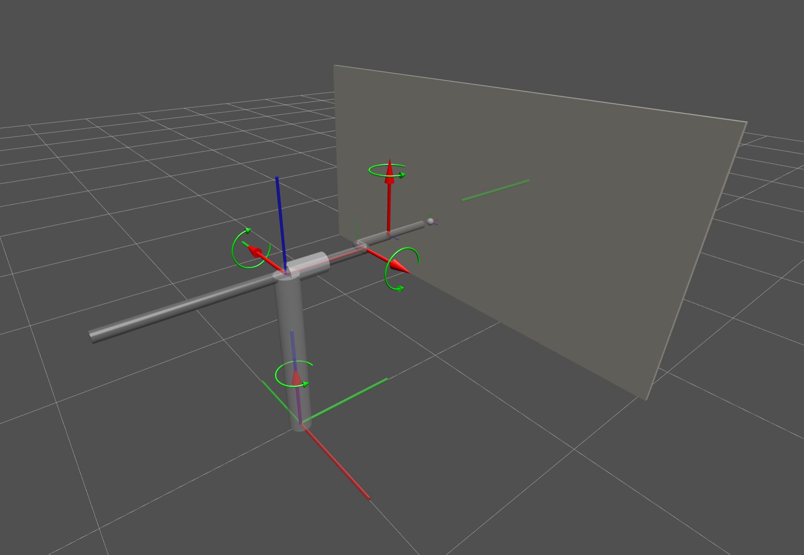
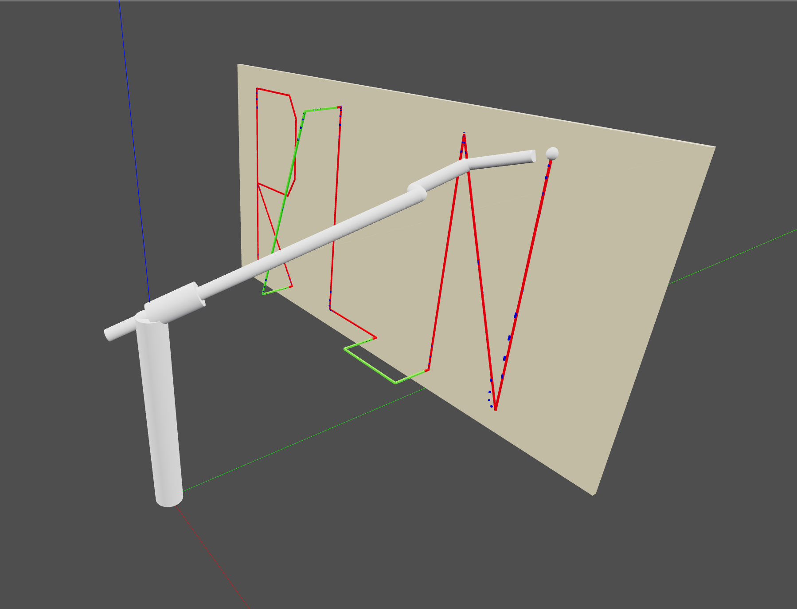
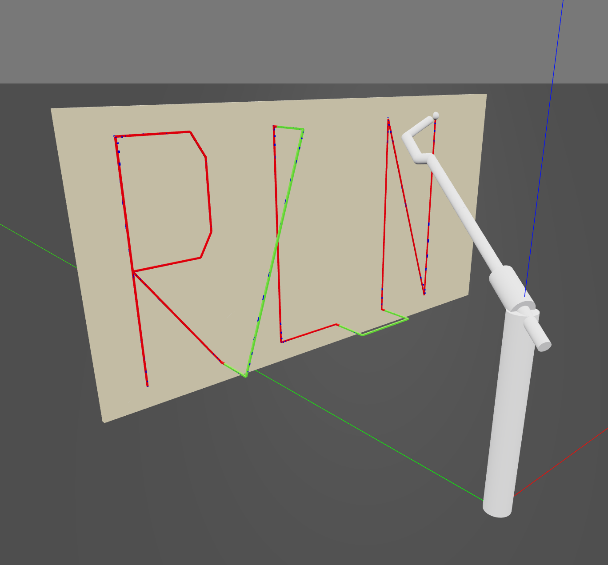

# Robot Arm Simulator - MCH 4951 Final Project

A Python-based 4-DOF robot arm simulator that writes letters on a 60×120cm virtual cardboard using forward/inverse kinematics and dynamics validation.

<p align="center">
  
  <br>
  <em>4-DOF robot arm with coordinate frames showing joint axes and link geometry</em>
</p>

<p align="center">
  
  <br>
  <em>Color-coded trajectory: Red lines show pen writing, green lines show pen retraction between letters</em>
</p>

<p align="center">
  
  <br>
  <em>Completed "RLN" letter sequence on virtual cardboard</em>
</p>

## Features

- Generic URDF-based robot loading (works with any URDF robot)
- Forward and inverse kinematics using Robotics Toolbox Python
- Trajectory generation for letter writing with smooth interpolation
- Static torque calculations with per-link gravity analysis
- Motor feasibility validation
- 3D matplotlib animation with real-time visualization
- Fully configurable via YAML

## Project Requirements (MCH 4951)

- 4+ DOF robot (independent links)
- 3D workspace (volumetric, not planar)
- ≥1 translational joint (prismatic wrist extension)
- ≥2 rotational joints (revolute base, shoulder, elbow)
- ≥1 offset (shoulder offset)
- Real materials (aluminum/steel with actual densities)
- Real motors (servo specifications with torque limits)
- Write 3 letters on 60×120cm cardboard
- Pen retracts between letters
- Calculate reachability, static/dynamic torques, feasibility

## Installation

```bash
# Create virtual environment
python -m venv venv

# Activate (Windows)
venv\Scripts\activate

# Activate (Linux/Mac)
source venv/bin/activate

# Install dependencies
pip install -r requirements.txt
```

## Usage

### Run Main Simulation
```bash
venv/Scripts/python.exe src/simulator.py
```

This will:
1. Load the robot from URDF
2. Generate trajectory for "RLN" letters
3. Solve inverse kinematics for all waypoints
4. Calculate torques at each configuration
5. Display 3D animation with pen trace
6. Show real-time torque plots

### Test Components Individually

**Test trajectory generation:**
```bash
venv/Scripts/python.exe src/trajectory_generator.py
```

**Visualize trajectory (debug tool):**
```bash
venv/Scripts/python.exe examples/visualize_trajectory.py
```

**Compare target vs reached positions:**
```bash
venv/Scripts/python.exe examples/compare_trajectory_vs_ik.py
```

**Interactive robot GUI:**
```bash
venv/Scripts/python.exe examples/robot_visualizer_gui.py
```

## Project Structure

```
MCH_4951_Final_Project/
├── config/
│   └── robot.urdf              # Robot geometry, masses, inertia, joint limits
├── src/
│   ├── config.yaml             # Motor specs, workspace, writing params
│   ├── simulator.py            # Main simulation loop and IK solver
│   └── trajectory_generator.py # Letter path generation
├── examples/
│   ├── visualize_trajectory.py # Debug: view generated waypoints
│   ├── compare_trajectory_vs_ik.py # Debug: compare target vs reached
│   └── robot_visualizer_gui.py # Interactive robot control GUI
├── images/
│   ├── 1.png                   # Robot structure visualization
│   ├── 2.png                   # Trajectory with color-coded paths
│   └── 3.png                   # Final letter writing result
├── requirements.txt            # Python dependencies
├── CLAUDE.md                   # Development instructions
└── README.md                   # This file
```

## Configuration

### Robot Configuration (config/robot.urdf)
Define robot geometry using standard URDF format:
- Link lengths, masses, inertia tensors
- Joint types (revolute, prismatic), axes, limits
- Material properties

### Application Configuration (src/config.yaml)
- Motor torque specifications
- Workspace dimensions and cardboard position
- Letter parameters (height, spacing, margins)
- IK settings (mask, max joint step)
- Visualization settings

## Robot Specifications

### Physical Configuration
- **Total DOF**: 4 (base revolute, shoulder revolute, elbow revolute, wrist prismatic)
- **Workspace**: 3D volumetric workspace reaching 60x120cm cardboard
- **Materials**: Aluminum links with steel base (real material densities)
- **End Effector**: Prismatic wrist extension with pen holder

### Performance Metrics
- **IK Success Rate**: 100% (111/111 waypoints)
- **Average IK Error**: < 0.0001m
- **Letters**: 48cm tall "RLN" on 60x120cm cardboard
- **Pen Retraction**: Automatic retraction between letters to avoid unwanted marks

### Torque Analysis
Based on static analysis with per-link gravity calculations:
- **Base Joint (Revolute)**: 0.00 Nm (vertical axis, no gravity component)
- **Shoulder Joint (Revolute)**: ~56 Nm maximum
- **Elbow Joint (Revolute)**: ~50 Nm maximum
- **Wrist Extension (Prismatic)**: ~39 N maximum force

### Motor Specifications
Selected motors based on calculated torque requirements with safety margins:
- **Base**: Servo motor (low torque requirement)
- **Shoulder**: High-torque servo (60+ Nm rating)
- **Elbow**: High-torque servo (55+ Nm rating)
- **Wrist**: Linear actuator (50+ N force rating)

## Technical Details

### Robotics Toolbox Integration
- Robot loaded via `Robot.URDF()`
- Forward kinematics: `robot.fkine(q)`
- Inverse kinematics: `robot.ikine_LM(T, q0, mask)`
- Gravity torques: `robot.pay(W, q, frame)` per-link
- Cartesian interpolation: `rtb.ctraj(T1, T2, t)`

### Trajectory Generation
1. Generate letter paths (normalized 0-1 coordinates)
2. Scale to cardboard dimensions with margins
3. Add pen retraction moves between letters
4. Interpolate with quintic polynomials (smooth velocity/acceleration)

### IK Solving
- Position-only constraint (orientation free)
- Uses previous solution as initial guess for continuity
- Handles angle wrapping for revolute joints
- Detects and smooths large joint jumps

## Tech Stack

- **Robotics Toolbox Python**: Kinematics, dynamics, URDF parsing
- **Spatial Math Python**: SE3 transforms and rotations
- **NumPy/SciPy**: Numerical calculations
- **Matplotlib**: 3D visualization and animation
- **PyYAML**: Configuration file parsing

## License

Educational project for MCH 4951 Robotics.
